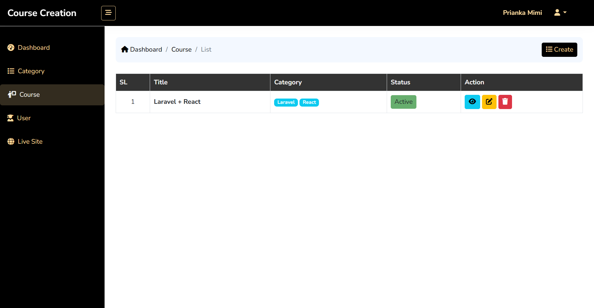

# Course Creation System

A comprehensive Laravel-based course creation and management system with modular structure for organizing educational content. This project demonstrates clean architecture, proper separation of concerns, and professional Laravel development practices for building scalable learning platforms.

## Author

[Fatema Akther Prianka 🤗](https://github.com/Prianka-Mimi)

## 🚀 Features

### Admin Features
- **Category Management**: Create, update, delete, and list course categories
- **Course Management**: Manage courses with titles, descriptions, feature videos, and status
- **Module Management**: Organize courses into modules for structured learning
- **Content Management**: Add various content types (text, images, videos, links) to modules
- **Dashboard**: Statistics overview with counts for categories, courses, modules, and contents
- **Role-based Access**: Secure admin-only access to management features

### User Features
- **Course Browsing**: View available courses with descriptions and categories
- **Module Navigation**: Access course modules and their contents
- **Content Viewing**: Support for different content types including videos, text, and images
- **Category Filtering**: Browse courses by categories

### Technical Features
- **Modular Architecture**: Courses divided into modules and contents for flexible learning paths
- **Many-to-Many Relationships**: Courses can belong to multiple categories
- **Optimized Queries**: Efficient database operations with proper relationships
- **Request Validation**: Dedicated request classes for data validation
- **Clean Architecture**: Model-Controller separation with business logic in models
- **Status Management**: Active/Inactive status for all entities

## 🛠️ Technology Stack

- **Framework**: Laravel 12.x
- **Database**: MySQL
- **Authentication**: Laravel Breeze (Session-based)
- **Frontend**: Blade Templates with Tailwind CSS
- **Development Server**: Laragon
- **Query Optimization**: Eloquent relationships and eager loading
- **Authorization**: Breeze

## 🔧 Installation & Setup

### Prerequisites
- PHP 8.2 or higher
- Composer
- MySQL
- Laragon/XAMPP/WAMP

### Step 1: Clone Repository
```bash
git clone https://github.com/prianka-mimi/course-creation-system.git
cd course-creation-system
```

### Step 2: Install Dependencies
```bash
composer install
npm install && npm run build
```

### Step 3: Environment Configuration
```bash
cp .env.example .env
php artisan key:generate
```

Update `.env` file with your database credentials:
```env
DB_CONNECTION=mysql
DB_HOST=127.0.0.1
DB_PORT=3306
DB_DATABASE=course_creation_system
DB_USERNAME=root
DB_PASSWORD=
```

### Step 4: Database Setup
```bash
php artisan migrate
php artisan db:seed
```

### Step 5: Start Development Server
```bash
php artisan serve
```

Visit: `http://localhost:8000`

## 🔐 Default Admin Credentials
- **Email**: prianka@gmail.com
- **Password**: 12345678

## 📡 API Endpoints (If Applicable)

The system primarily uses web interfaces, but RESTful endpoints can be added for API integration.

### Base URL
```
http://localhost:8000
```

## 🏗️ Project Structure

### Models
- **User**: Handles user authentication and roles
- **Category**: Manages course categories with many-to-many relationship to courses
- **Course**: Core entity with modules, categories, and metadata
- **Module**: Belongs to courses, contains contents
- **Content**: Various content types (text, image, video, link) belonging to modules

### Controllers
- **CategoryController**: CRUD operations for categories
- **CourseController**: Course management with category associations
- **DashboardController**: Admin dashboard with statistics

### Request Classes
- **StoreCategoryRequest**: Category creation validation
- **UpdateCategoryRequest**: Category update validation
- **StoreCourseRequest**: Course creation validation
- **UpdateCourseRequest**: Course update validation

### Key Features Implementation

#### Many-to-Many Category Relationships
- Pivot table `category_course` for flexible category assignments
- `belongsToMany` relationships in Category and Course models
- Efficient querying with eager loading

#### Modular Content Structure
- Hierarchical organization: Course > Module > Content
- Support for multiple content types (text, image, video, link)
- Status management for all entities

#### Optimized Database Queries
- Eager loading with `with()` to prevent N+1 problems
- Proper indexing on foreign keys
- Efficient pagination with customizable per_page

#### Clean Architecture
- Business logic in models and managers
- Controllers handle HTTP requests/responses
- Dedicated request classes for validation
- Consistent data preparation methods

## 🧪 Testing the Application

### Web Interface Testing

1. **Register/Login**: Create user accounts and login
2. **Create Categories**: Add course categories
3. **Create Courses**: Add courses with category associations
4. **Add Modules**: Organize courses into modules
5. **Add Contents**: Populate modules with various content types

## 📱 Web Interface

### Admin Panel Features
- Dashboard with statistics cards (total categories, courses, modules, contents)
- Category management (CRUD operations)
- Course management with category selection
- Module management per course
- Content management with type-specific fields
- User list and profile management

### User Features
- Course browsing with category filters
- Module navigation within courses
- Content viewing with appropriate rendering for each type
- Profile editing and password updates

## 🔍 Code Quality Features

- **No N+1 Queries**: Optimized database queries with eager loading
- **Request Validation**: Separate request classes for each operation
- **Error Handling**: Comprehensive validation and user feedback
- **Clean Controllers**: Minimal controller logic, business logic in models
- **Modular Design**: Separation of concerns with managers and helpers
- **Consistent Naming**: Professional Laravel conventions throughout

## 📸 Screenshots





## 🤝 Contributing

1. Fork the repository
2. Create a feature branch
3. Commit your changes
4. Push to the branch
5. Create a Pull Request

## ✨ Contact

<div align="left">
  <a href="https://webdeveloperprianka.netlify.app/" target="_blank"> 
    
  </a>
  <a href="https://www.linkedin.com/in/fatema-akther-prianka/" target="_blank">
    
  </a>
  <a href="https://stackoverflow.com/users/23182049/prianka-mimi" target="_blank">
    
  </a>
  <a href="https://leetcode.com/u/prianka-mimi/" target="_blank">
  
  </a>
    <a href="mailto:priankamimi0204@gmail.com" target="_blank">
    
  </a>
  <a href="https://discord.com/channels/@me" target="_blank">
    
  </a>
  <a href="https://www.facebook.com/fatemaaktherprianka.webdeveloper" target="_blank">
    
  </a>
</div>
